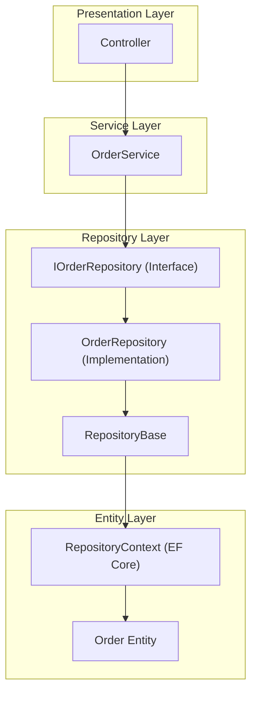

# 🍔 FoodEaseAPI Architecture - Entity to Repository Flow

I've analyzed the codebase and here's how the API is structured from Entity to Repository level:

---

## Architecture Overview



---

## Layer Breakdown

### 1️⃣ Entity Layer (`Entities/DatabaseModels/`)
- **[`Order.cs`](Entities/DatabaseModels/Order.cs)** - Database table representation (EF Core entity)
- Contains navigation properties (`Items`, `PaymentChannels`, `Transaction`, etc.)
- Inherits from `DbEntity` for `Id`, `CreatedAt`, `UpdatedAt`

### 2️⃣ DTOs (`Entities/DataTransferObjects/`)
- **[`AddOrderDto.cs`](Entities/DataTransferObjects/AddOrderDto.cs)** - Request objects from clients
- Maps incoming data to entities

### 3️⃣ Repository Contracts (`Contracts/`)
- **[`IOrderRepository.cs`](Contracts/IOrderRepository.cs)** - Interface defining available operations
- Returns `ServiceResponseModel<T>` with `.Status`, `.Data`, `.Message`
- Parameters: `bool trackChanges` to control EF Core tracking

### 4️⃣ Repository Implementation (`Repository/ModelRepositories/`)
- **[`OrderRepository.cs`](Repository/ModelRepositories/OrderRepository.cs)** - Actual implementation
- Inherits from `RepositoryBase<Order>`
- Uses EF Core with `.Include()` for eager loading

### 5️⃣ RepositoryBase (`Repository/`)
- Generic base class providing `Create()`, `ListAll()`, `Update()`, `Delete()`

### 6️⃣ RepositoryManager (`Repository/RepositoryManager.cs`)
- Facade exposing all repositories via `Lazy<T>` initialization
- Services access repositories through this manager

---

## Data Flow
```
Client Request → Controller → Service → IOrderRepository 
    → OrderRepository → RepositoryBase → RepositoryContext 
    → PostgreSQL Database
```

The codebase uses: **Repository Pattern**, **Unit of Work**, **Generic Repository**, and **ServiceResponseModel<T>** wrapper pattern.